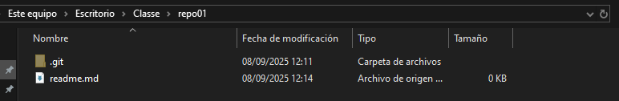

# Exercici 2 
## Markdown

1. Creem un directori on treballarem  
   
2. Anirem a la terminal i ens situarem al directori ja creat  
   
3. Posarem la comanda *git init*  
   
4. Així podem comprovar que s'ha iniciat el repositori correctament
